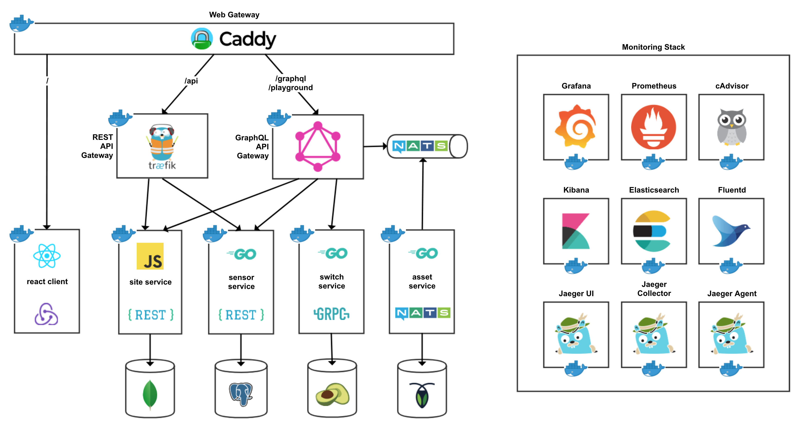

[![Build Status][asset-image]][asset-url]
[![Build Status][client-image]][client-url]
[![Build Status][graphql-image]][graphql-url]
[![Build Status][sensor-image]][sensor-url]
[![Build Status][site-image]][site-url]
[![Build Status][switch-image]][switch-url]

# Microservices

This demo application shows how a microservices architecture can be implemented and applied!
This demo application covers the following topics:

  * Front-end client (React, Redux, etc.)
  * Back-end services (Go and JavaScript)
  * REST, gRPC, GraphQL, and Messaging
  * Logging, Metrics, Tracing, and Dashboards
  * Web Gateway, API Gateway, and TLS
  * Containerization and Orchestration

## Up & Running

  - [x] docker-compose
  - [ ] Kubernetes
  - [ ] Nomad

## Architecture

[asset-url]: https://github.com/moorara/microservices-demo/actions?workflow=Asset
[asset-image]: https://github.com/moorara/microservices-demo/workflows/Asset/badge.svg
[client-url]: https://github.com/moorara/microservices-demo/actions?workflow=Client
[client-image]: https://github.com/moorara/microservices-demo/workflows/Client/badge.svg
[graphql-url]: https://github.com/moorara/microservices-demo/actions?workflow=GraphQL
[graphql-image]: https://github.com/moorara/microservices-demo/workflows/GraphQL/badge.svg
[sensor-url]: https://github.com/moorara/microservices-demo/actions?workflow=Sensor
[sensor-image]: https://github.com/moorara/microservices-demo/workflows/Sensor/badge.svg
[site-url]: https://github.com/moorara/microservices-demo/actions?workflow=Site
[site-image]: https://github.com/moorara/microservices-demo/workflows/Site/badge.svg
[switch-url]: https://github.com/moorara/microservices-demo/actions?workflow=Switch
[switch-image]: https://github.com/moorara/microservices-demo/workflows/Switch/badge.svg
